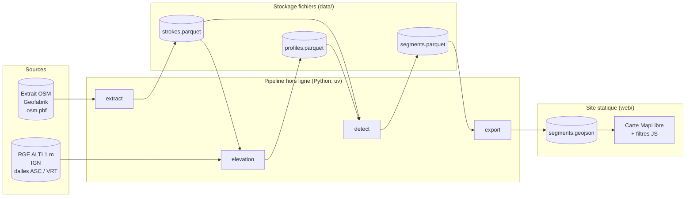
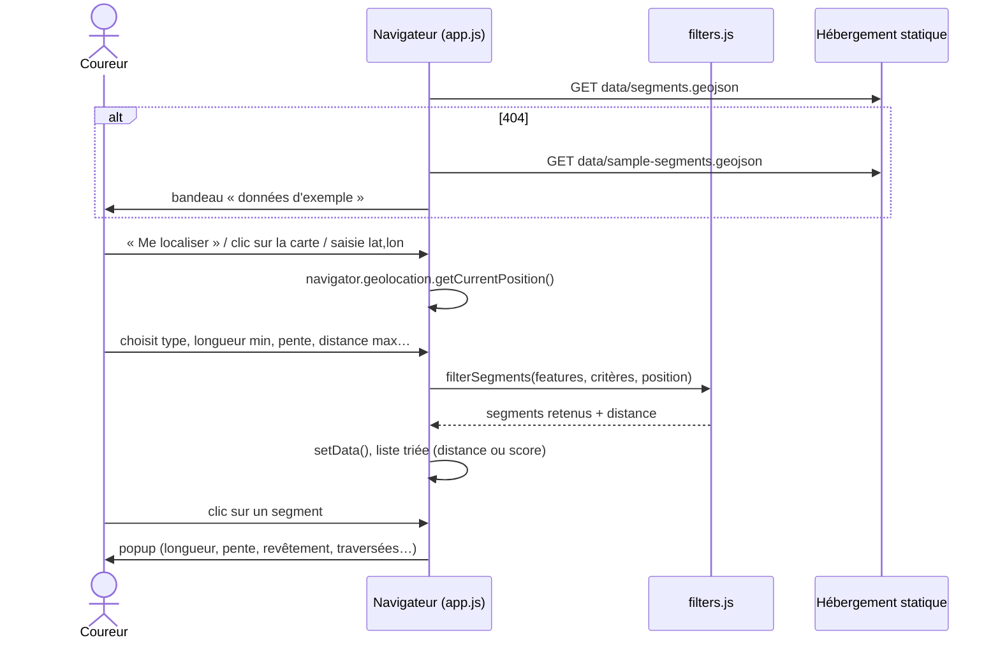
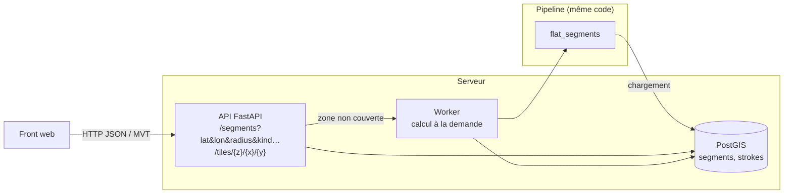

# Architecture

Ce document décrit l'organisation de `flat-segments` : ses composants, le
chemin des données et les phases prévues. Les choix structurants sont justifiés
dans les [ADR](adr/README.md), et le détail des calculs dans
[`algorithm.md`](algorithm.md).

## 1. Principes

1. **Tout calculer à l'avance, hors ligne.** Détecter les segments demande
   de croiser un réseau routier avec un modèle numérique de terrain (MNT)
   au mètre, ce qui est trop lourd pour un navigateur. Un pipeline Python
   produit donc, une fois pour une zone, la liste des segments candidats
   et leurs attributs ([ADR 0001](adr/0001-pipeline-python-uv.md)).
2. **Un front statique d'abord.** Le navigateur charge les segments
   précalculés et fait lui-même le filtrage (longueur, pente, distance,
   traversées). Pas de serveur à maintenir : un hébergement GitHub Pages
   suffit ([ADR 0005](adr/0005-front-statique-maplibre.md)).
3. **Des fichiers plutôt qu'une base.** Chaque étape du pipeline lit et écrit
   des fichiers (GeoParquet), ce qui les rend inspectables et rejouables
   séparément ([ADR 0004](adr/0004-stockage-geoparquet.md)). PostGIS
   n'arrive qu'avec l'API (phase 3).
4. **La logique pure séparée des entrées/sorties.** Les calculs (géométrie,
   profils, fenêtre glissante…) ne manipulent que des tableaux numpy et des
   dataclasses. On les teste sur des données synthétiques, sans fichier ni
   réseau.
5. **Des calculs en mètres.** Le pipeline travaille en Lambert-93
   (EPSG:2154) et ne passe en WGS84 (EPSG:4326) qu'à l'export pour le web
   (voir [`data-sources.md`](data-sources.md#projections)).

## 2. Vue d'ensemble



## 3. Composants

### 3.1 Pipeline Python (`src/flat_segments/`)

Chaque étape est une commande de la CLI Typer `flat-segments` :

| Commande | Entrée | Sortie | Modules |
|---|---|---|---|
| `extract` | extrait OSM `.osm.pbf` + emprise | `data/interim/strokes.parquet` | `osm.py`, `network.py` |
| `elevation` | strokes + MNT (GeoTIFF/VRT en Lambert-93) | `data/interim/profiles.parquet` | `elevation.py` |
| `detect` | strokes + profils | `data/processed/segments.parquet` | `profile.py`, `detect.py` |
| `export` | segments | `web/data/segments.geojson` | `export.py` |

Le découpage en quatre commandes permet de régler les seuils de détection
(`detect`) sans relire le PBF ni rééchantillonner le MNT.

Les modules :

| Module | Rôle | Nature |
|---|---|---|
| `params.py` | Paramètres de l'algorithme (dataclasses figées) avec leurs valeurs par défaut | pur |
| `geometry.py` | Longueurs, rééchantillonnage, sous-polyligne, sinuosité, caps, distances point-polyligne, id stable | pur |
| `osm.py` | Classement des voies selon leurs tags OSM ; lecture du PBF (pyosmium) et reprojection | pur + E/S |
| `network.py` | Graphe des voies, chaînage en *strokes* (polylignes continues), événements (traversées, carrefours) | pur |
| `elevation.py` | Échantillonnage du MNT le long des strokes (interpolation bilinéaire), accès raster | pur + E/S |
| `profile.py` | Profil en long : bouche-trous, interpolation sous ponts et tunnels, lissage, pente locale, D+/D- | pur |
| `detect.py` | Fenêtre glissante, fusion en tronçons maximaux, attributs, score, déduplication | pur |
| `export.py` | Lecture/écriture GeoParquet, export GeoJSON (WGS84) | E/S |
| `cli.py` | CLI Typer, câblage des étapes | E/S |

Dépendances : numpy (calcul), pyosmium (OSM), pyproj (projections), rasterio
(MNT), geopandas/pyarrow/shapely (GeoParquet), Typer (CLI).

### 3.2 Stockage

Au stade prototype, tout le stockage est fait de fichiers dans `data/`
(non versionné) :

```
data/
├── raw/          # téléchargements : .osm.pbf, dalles RGE ALTI, VRT
├── interim/      # strokes.parquet, profiles.parquet
└── processed/    # segments.parquet (GeoParquet, Lambert-93)
```

Le schéma de chaque table est décrit dans [`data-model.md`](data-model.md).
Le GeoJSON destiné au web est écrit dans `web/data/`.

### 3.3 Front statique (`web/`)

- `index.html`, `style.css` : une page, sans framework ni étape de build.
- `app.js` : carte MapLibre GL JS (chargée depuis un CDN, version figée), fond
  vectoriel OpenFreeMap, couche des segments, panneau de filtres, liste des
  résultats, géolocalisation.
- `filters.js` : module ES **pur** (distance haversine, distance point-ligne,
  filtrage, tri), testé avec `node --test`.
- `data/segments.geojson` : segments réels quand ils existent ;
  `data/sample-segments.geojson` sinon (données fictives).



Le site est hébergeable sur GitHub Pages tel quel (dossier `web/`).

### 3.4 Future API (phase 3)

Quand le volume ou le besoin de calcul à la demande dépasseront le modèle
statique :



- La table PostGIS `segments` reprend le schéma de
  [`data-model.md`](data-model.md). Les requêtes de proximité utilisent
  `ST_DWithin` sur un index GiST.
- Les modules purs du pipeline sont réutilisés tels quels. Seule la couche
  d'E/S change (lecture depuis PostGIS, écriture en base).
- Le front garde la même logique d'affichage ; seule la source des données
  change (API plutôt que fichier statique).

## 4. Flux de données détaillé


## 5. Phases

| Phase | Contenu | Données | Livrable |
|---|---|---|---|
| **0 — Squelette** *(en cours)* | Documents d'architecture, logique pure testée, stubs d'E/S, front sur données fictives, CI | synthétiques | ce dépôt |
| **1 — Prototype pilote** | Implémentation complète de `extract` et `elevation`, calibrage des seuils sur le terrain (Labège / Caraman), publication GitHub Pages | OSM + RGE ALTI de la zone pilote | site statique en ligne |
| **2 — Passage à l'échelle régionale** | Toute l'ex-région Midi-Pyrénées, export PMTiles si le GeoJSON dépasse quelques Mo, parallélisation par dalle | OSM Midi-Pyrénées + RGE ALTI par département | site statique + PMTiles |
| **3 — API** | FastAPI + PostGIS, multi-régions, calcul à la demande, mises à jour OSM incrémentales, repli sur un MNT 30 m hors de France | multi-sources | API + front |

Critère de passage de la phase 1 à la phase 2 : sur un échantillon de segments
vérifiés à pied, la précision est jugée suffisante (segments annoncés plats
réellement plats, traversées correctement comptées).

## 6. Qualité et outillage

- **Tests** : pytest sur des profils et des réseaux synthétiques (pente
  constante, bosse, bruit, zigzag, pont…) ; `node --test` pour le filtrage JS.
- **Lint et types** : ruff (lint + format), mypy en mode strict.
- **pre-commit** : ruff, mypy, hygiène des fichiers, refus des gros fichiers
  (aucune donnée volumineuse dans Git).
- **CI GitHub Actions** : lint, types, tests Python (3.12 et 3.13), tests JS.

## 7. Pièges connus

| Piège | Effet | Parade |
|---|---|---|
| Ponts, passerelles | Le MNT donne l'altitude du sol **sous** l'ouvrage (rivière, route) : fausse descente puis remontée | Tags `bridge=*` : altitude interpolée linéairement entre les culées, segment marqué `bridge_interpolated` |
| Tunnels, passages souterrains | Le MNT donne l'altitude **au-dessus** : fausse bosse | Tags `tunnel=*` / `covered=yes` : même interpolation, marquage `tunnel_interpolated` |
| Talus, remblais, digues | Un décalage de la géométrie OSM de 2 à 5 m fait tomber les points sur le flanc du talus : bruit de profil | Lissage ; échantillonnage transversal (médiane sur ±2 m) en option ; `layer` et `embankment` notés |
| Qualité variable du RGE ALTI | Précision décimétrique en zone LiDAR, métrique en zone de corrélation | Voir [`data-sources.md`](data-sources.md) ; à terme, source et précision du MNT par segment |
| Qualité OSM variable | Revêtement ou éclairage souvent absents ; traversées non modélisées si les voies ne partagent pas de nœud | Valeur `unknown` explicite ; validation terrain en phase 1 |
| Trottoirs cartographiés en double | Un trottoir `footway=sidewalk` et sa rue donnent deux segments quasi identiques | Déduplication géométrique (§ 9 de l'algorithme) |
| Routes ≥ `tertiary` avec trottoir non cartographié séparément | Tronçon ignoré, alors qu'il serait praticable | Limite assumée au prototype |
| Données figées | Chantier récent, nouvelle voie verte… | Date de l'extrait OSM et du MNT dans les métadonnées de l'export |
