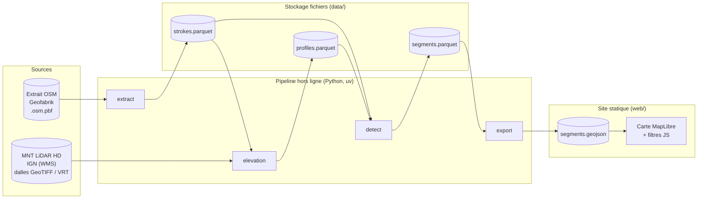
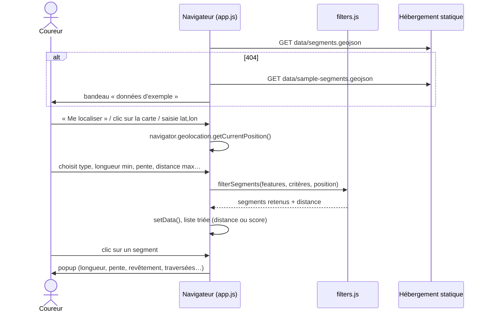
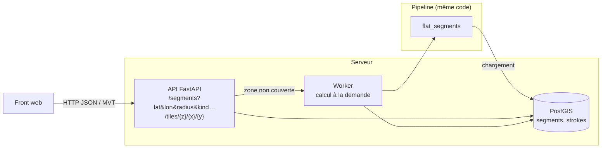
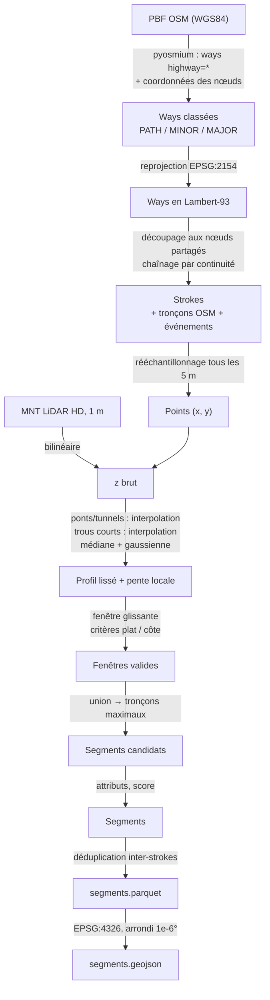

# Architecture

Ce document décrit l'organisation de `flat-segments` : ses composants, le
chemin des données et les phases prévues. Les choix structurants sont justifiés
dans les [ADR](adr/README.md), et le détail des calculs dans
[`algorithm.md`](algorithm.md).

## 1. Principes

1. **Tout calculer à l'avance, hors ligne.** Détecter les segments demande
   de croiser un réseau routier avec un modèle numérique de terrain (MNT)
   au mètre, ce qui est trop lourd pour un navigateur. Un pipeline Python
   produit donc, une fois pour une zone, la liste des segments candidats
   et leurs attributs ([ADR 0001](adr/0001-pipeline-python-uv.md)).
2. **Un front statique d'abord.** Le navigateur charge les segments
   précalculés et fait lui-même le filtrage (longueur, pente, distance,
   traversées). Pas de serveur à maintenir : un hébergement GitHub Pages
   suffit ([ADR 0005](adr/0005-front-statique-maplibre.md)).
3. **Des fichiers plutôt qu'une base.** Chaque étape du pipeline lit et écrit
   des fichiers (GeoParquet), ce qui les rend inspectables et rejouables
   séparément ([ADR 0004](adr/0004-stockage-geoparquet.md)). PostGIS
   n'arrive qu'avec l'API (phase 3).
4. **La logique pure séparée des entrées/sorties.** Les calculs (géométrie,
   profils, fenêtre glissante…) ne manipulent que des tableaux numpy et des
   dataclasses. On les teste sur des données synthétiques, sans fichier ni
   réseau.
5. **Des calculs en mètres.** Le pipeline travaille en Lambert-93
   (EPSG:2154) et ne passe en WGS84 (EPSG:4326) qu'à l'export pour le web
   (voir [`data-sources.md`](data-sources.md#projections)).

## 2. Vue d'ensemble



## 3. Composants

### 3.1 Pipeline Python (`src/flat_segments/`)

Chaque étape est une commande de la CLI Typer `flat-segments` :

| Commande | Entrée | Sortie | Modules |
|---|---|---|---|
| `download-osm` | URL de l'extrait (Geofabrik ou miroir OSM France) + emprise | `data/raw/midi-pyrenees-latest.osm.pbf` (ou `midi_pyrenees.osm.pbf`), `data/raw/pilot.osm.pbf` (découpé) | `download.py`, `osm.py` |
| `download-dem` | emprise + service WMS de la Géoplateforme | `data/raw/dem/tiles/*.tif`, `data/raw/dem/pilot.vrt` | `download.py` |
| `extract` | extrait OSM `.osm.pbf` + emprise | `data/interim/strokes.parquet` | `osm.py`, `network.py` |
| `elevation` | strokes + MNT (GeoTIFF/VRT en Lambert-93) | `data/interim/profiles.parquet` | `elevation.py` |
| `detect` | strokes + profils | `data/processed/segments.parquet` | `profile.py`, `detect.py` |
| `export` | segments | `web/data/segments.geojson` | `export.py` |
| `pipeline` | extrait découpé + MNT | les quatre sorties ci-dessus | `pipeline.py` |

Le découpage en quatre étapes permet de régler les seuils de détection
(`detect`) sans relire le PBF ni rééchantillonner le MNT.

**Paramètres.** Les étapes utilisent les valeurs par défaut de `params.py`,
remplacées par un fichier TOML (`--config`, modèle dans
`configs/default.toml`) puis par des surcharges `--set cle=valeur`. `detect`
enregistre les paramètres utilisés à côté de ses segments
(`segments.params.toml`), et `export` les recopie dans les métadonnées du
GeoJSON : un jeu publié dit toujours comment il a été produit.

**Calibrage** (phase 1) :

| Commande | Rôle |
|---|---|
| `report` | Résumé d'un fichier de segments : nombres, longueurs, longueurs cibles, traversées, revêtements, *flags* |
| `sweep` | Relance la détection pour plusieurs valeurs d'un paramètre et compare les résultats |
| `compare` | Compare deux fichiers de segments (deux MNT, deux réglages, deux passages) : nombres, km, part des km de chacun retrouvée dans l'autre à 10 m près, segments manquants |
| `inspect` | Profil brut / lissé et pente locale autour d'un segment (PNG, matplotlib) |
| `validation-sheet` | Échantillon représentatif de segments sous forme de fiche terrain à remplir ([`validation/`](validation/README.md)) |
| `config` | Affiche les paramètres effectifs en TOML |

Les modules :

| Module | Rôle | Nature |
|---|---|---|
| `params.py` | Paramètres de l'algorithme (dataclasses figées, invariants vérifiés) avec leurs valeurs par défaut | pur |
| `config.py` | Paramètres en TOML : lecture, écriture, surcharges `cle=valeur` | pur + E/S |
| `geometry.py` | Longueurs, rééchantillonnage, sous-polyligne, sinuosité, caps, distances point-polyligne, id stable | pur |
| `osm.py` | Classement des voies selon leurs tags OSM ; lecture du PBF (pyosmium) et reprojection | pur + E/S |
| `network.py` | Graphe des voies, chaînage en *strokes* (polylignes continues), événements (traversées, carrefours) | pur |
| `elevation.py` | Échantillonnage du MNT le long des strokes (interpolation bilinéaire), accès raster | pur + E/S |
| `profile.py` | Profil en long : bouche-trous, interpolation sous ponts et tunnels, lissage, pente locale, D+/D- | pur |
| `detect.py` | Fenêtre glissante, fusion en tronçons maximaux, attributs, score, déduplication | pur |
| `export.py` | Lecture/écriture GeoParquet, export GeoJSON (WGS84) | E/S |
| `download.py` | Téléchargements : extrait OSM (MD5), dalles MNT par WMS, assemblage en VRT | E/S |
| `pipeline.py` | Les quatre étapes sous forme de fonctions, partagées par les commandes | E/S |
| `calibration.py` | Rapport, balayage de paramètres, graphique de profil, fiche de validation | pur + E/S |
| `cli.py` | CLI Typer, câblage des étapes | E/S |

Dépendances : numpy (calcul), pyosmium (OSM), pyproj (projections), rasterio
(MNT), geopandas/pyarrow/shapely (GeoParquet), Typer (CLI).

### 3.2 Stockage

Au stade prototype, tout le stockage est fait de fichiers dans `data/`
(non versionné) :

```
data/
├── raw/
│   ├── midi-pyrenees-latest.osm.pbf   # extrait régional (Geofabrik ou miroir)
│   ├── pilot.osm.pbf                  # extrait découpé sur la zone pilote
│   └── dem/
│       ├── tiles/*.tif                # dalles MNT LiDAR HD (GeoTIFF compressés)
│       └── pilot.vrt                  # mosaïque virtuelle GDAL
├── interim/      # strokes.parquet, profiles.parquet
└── processed/    # segments.parquet (GeoParquet, Lambert-93), segments.params.toml, inspect/*.png
```

Le schéma de chaque table est décrit dans [`data-model.md`](data-model.md).
Le GeoJSON destiné au web est écrit dans `web/data/`.

### 3.3 Front statique (`web/`)

- `index.html`, `style.css` : une page, sans framework ni étape de build.
- `app.js` : carte MapLibre GL JS (module ES chargé depuis un CDN par une
  *import map*, version figée et empreintes SRI), fond vectoriel OpenFreeMap
  avec repli sur un fond uni, couche des segments, panneau de filtres, liste
  des résultats, géolocalisation.
- `filters.js` : module ES **pur** (distance haversine, distance point-ligne,
  filtrage, tri, état de l'URL), testé avec `node --test` (`web/tests/`,
  `web/package.json` ne sert qu'aux tests).
- **Liens directs** : `?id=<segment>` ouvre un segment, `?lat=…&lon=…` fixe la
  position et `?kind=climb` affiche les côtes. Le segment d'un lien reste
  affiché même s'il sort des filtres (une côte à 2,97 % avec un minimum de
  3 %, par exemple), jusqu'à la fermeture de sa fiche. L'URL suit la sélection, ce qui
  sert à partager un segment et à la fiche de validation terrain.
- **Publication** : le workflow `.github/workflows/pages.yml` déploie `web/`
  (sans les tests) sur GitHub Pages à chaque modification sur `main`.
- `data/segments.geojson` : segments réels quand ils existent ;
  `data/sample-segments.geojson` sinon (données fictives).



Le site est hébergeable sur GitHub Pages tel quel (dossier `web/`).

### 3.4 Future API (phase 3)

Facultative depuis l'[ADR 0008](adr/0008-couverture-nationale-precalcul-statique.md) :
la France est couverte par précalcul statique. L'API ne servirait qu'à ce que
le statique ne sait pas faire (étranger, fraîcheur des données, critères
personnalisés, retours des utilisateurs) :



- La table PostGIS `segments` reprend le schéma de
  [`data-model.md`](data-model.md). Les requêtes de proximité utilisent
  `ST_DWithin` sur un index GiST.
- Les modules purs du pipeline sont réutilisés tels quels. Seule la couche
  d'E/S change (lecture depuis PostGIS, écriture en base).
- Le front garde la même logique d'affichage ; seule la source des données
  change (API plutôt que fichier statique).

## 4. Flux de données détaillé



## 5. Phases

| Phase | Contenu | Données | Livrable |
|---|---|---|---|
| **0 — Squelette** *(terminée)* | Documents d'architecture, logique pure testée, E/S testées sur fichiers synthétiques, front sur données fictives, CI | synthétiques | ce dépôt |
| **1 — Prototype pilote** *(terminée)* | Téléchargements automatisés, configuration TOML, outils de calibrage, liens directs et déploiement Pages, exécution sur les vraies données, calibrage des seuils, publication, validation terrain (Labège / Caraman : 15 segments conformes sur 18, aucune erreur de pente ni de traversée) | OSM + MNT LiDAR HD de la zone pilote | site statique en ligne |
| **2 — Couverture nationale par précalcul** *(à venir)* | Précalcul par département, export PMTiles, front sur tuiles ; d'abord l'ex-Midi-Pyrénées sur GitHub Pages, puis la France sur un stockage d'objets ([ADR 0008](adr/0008-couverture-nationale-precalcul-statique.md)) | OSM + MNT LiDAR HD (RGE ALTI où il manque), par département | site statique + PMTiles |
| **3 — API** *(facultative)* | Seulement pour ce que le statique ne sait pas faire : étranger (MNT 30 m), mises à jour OSM au fil de l'eau, critères personnalisés, retours des utilisateurs | multi-sources | API + front |

Critère de passage de la phase 1 à la phase 2 : sur un échantillon de segments
vérifiés à pied, la précision est jugée suffisante (segments annoncés plats
réellement plats, traversées correctement comptées). Il est rempli depuis la
[campagne 1](validation/README.md#campagne-1--zone-pilote-octobre-2026).

### 5.1 Plan de la phase 2

Objectif : toute la France, réponse instantanée, hébergement statique
([ADR 0008](adr/0008-couverture-nationale-precalcul-statique.md)). Les
ordres de grandeur ci-dessous sont extrapolés de la zone pilote et seront
recalés à l'échelle régionale.

| Étape | Contenu | Point à vérifier |
|---|---|---|
| **2.0 Mesures sur le pilote** *(faite, [rapport](phase-2/2.0-mesures.md))* | MNT au pas de 2 m : 98 à 99 % des km retrouvés, les 20 segments de la fiche terrain inchangés, téléchargement 3,5 fois plus rapide en dalles de 4 km. Outil PMTiles : tippecanoe ([ADR 0009](adr/0009-pmtiles-tippecanoe.md)) | Adoption du pas de 2 m : soumise à validation |
| **2.1 Pipeline par département** | Commande de traitement d'une liste de zones (contour du département), MNT téléchargé puis supprimé dalle par dalle, reprise après erreur, un `segments.parquet` par département | Disque et durée d'un département (≈ 6000 km², 2 à 3 h de MNT estimées) |
| **2.2 PMTiles et front sur tuiles** | Export PMTiles, tous les attributs à partir du zoom ≈ 12. Le front construit la liste à partir des tuiles chargées autour de la position ; liens directs `?id=` via un petit index (id → position) | Taille de l'index ; tri et filtre de distance sur les seuls segments chargés |
| **2.3 Ex-Midi-Pyrénées** | 8 départements (09, 12, 31, 32, 46, 65, 81, 82) publiés sur GitHub Pages. Campagne de validation 2 en zones rurales et en montagne | Taille réelle (quelques dizaines à ~150 Mo estimés) ; couverture LiDAR HD des Pyrénées |
| **2.4 Production automatisée** | Workflow GitHub Actions, une tâche par département, puis assemblage ; régénération périodique | Limites d'Actions (6 h et ~14 Go de disque par tâche) et limites d'usage de l'IGN |
| **2.5 France métropolitaine** | 96 départements, PMTiles (1 à 2 Go estimés) sur un stockage d'objets (type Cloudflare R2) | Changement d'hébergement, CORS et requêtes partielles |

## 6. Qualité et outillage

- **Tests** : pytest sur des profils et des réseaux synthétiques (pente
  constante, bosse, bruit, zigzag, pont…) ; `node --test` pour le filtrage JS.
- **Lint et types** : ruff (lint + format), mypy en mode strict.
- **pre-commit** : ruff, mypy, hygiène des fichiers, refus des fichiers de plus
  de 1 Mo (aucune donnée volumineuse dans Git). Seule exception : le jeu publié
  `web/data/segments.geojson`, plafonné à environ 10 Mo par
  l'[ADR 0005](adr/0005-front-statique-maplibre.md).
- **CI GitHub Actions** : lint, types, tests Python (3.12 et 3.13), tests JS ;
  déploiement GitHub Pages du front depuis `main`.
- **Réseau** : les téléchargements passent par une fonction d'ouverture d'URL
  injectable, ce qui permet de tout tester hors ligne (faux serveur WMS).

## 7. Pièges connus

| Piège | Effet | Parade |
|---|---|---|
| Ponts, passerelles | Le MNT donne l'altitude du sol **sous** l'ouvrage (rivière, route) : fausse descente puis remontée | Tags `bridge=*` : altitude interpolée linéairement entre les culées, segment marqué `bridge_interpolated` |
| Tunnels, passages souterrains | Le MNT donne l'altitude **au-dessus** : fausse bosse | Tags `tunnel=*` / `covered=yes` : même interpolation, marquage `tunnel_interpolated` |
| Talus, remblais, digues | Un décalage de la géométrie OSM de 2 à 5 m fait tomber les points sur le flanc du talus : bruit de profil | Lissage ; échantillonnage transversal (médiane sur ±2 m) en option ; `layer` et `embankment` notés |
| Qualité variable du MNT | RGE ALTI : précision décimétrique en zone LiDAR, métrique en zone de corrélation, et résolution effective d'environ 4 m par le WMS | MNT LiDAR HD par défaut ([ADR 0007](adr/0007-altitude-lidar-hd.md)) ; source du MNT publiée par segment (`elevation_source`) |
| Qualité OSM variable | Revêtement ou éclairage souvent absents ; traversées non modélisées si les voies ne partagent pas de nœud | Valeur `unknown` explicite ; validation terrain en phase 1 |
| Trottoirs cartographiés en double | Un trottoir `footway=sidewalk` et sa rue donnent deux segments quasi identiques | Déduplication géométrique (§ 9 de l'algorithme) |
| Routes ≥ `tertiary` avec trottoir non cartographié séparément | Tronçon ignoré, alors qu'il serait praticable | Limite assumée au prototype |
| Voies de service dans les parkings | Une voie `highway=service` sans `service=parking_aisle` qui traverse un parking donne un segment non praticable, et le cheminement piéton qui la longe passe pour un doublon (validation terrain, campagne 1) | Limite connue. Piste : exclure les voies `service` situées dans une zone `amenity=parking` |
| Données figées | Chantier récent, nouvelle voie verte… | Date de l'extrait OSM et du MNT dans les métadonnées de l'export |
