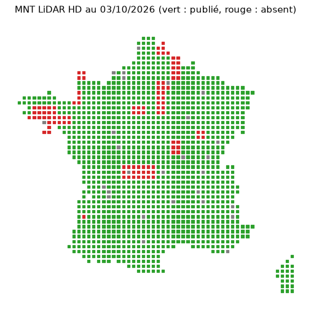

# Phase 2, étape 2.5 — France métropolitaine

Commencée le 02/10/2026, France en ligne le 03/10/2026. Le jeu publié passe
sur Cloudflare R2 ([ADR 0013](../adr/0013-donnees-sur-r2.md)), et
l'assemblage traite les départements un à un pour tenir dans la mémoire d'un
*runner*. Un essai sur l'Occitanie a précédé le lancement national.

Là où l'IGN n'a pas encore publié le MNT LiDAR HD (7,5 % du territoire, dont
Lille), cette version n'avait aucun segment
([ci-dessous](#couverture-du-mnt-lidar-hd)). La production passe désormais
sur le RGE ALTI dans ces zones, et les départements touchés ont été relancés
([repli](#repli-sur-le-rge-alti)).

## Publication sur R2

- **Contrôle préalable** : le workflow commence par un job `storage`, qui
  dure une dizaine de secondes :
  - écriture d'un petit fichier dans le bucket ;
  - lecture par l'adresse publique, par morceaux et avec l'en-tête `Origin`
    du site ;
  - suppression du fichier.

  Le job échoue si la réponse n'est pas `206`, ou si l'en-tête CORS manque.
  - Au premier essai, les réglages du dépôt n'étaient pas visibles du
    workflow : il est passé en repli (release) et l'essai a été annulé.
  - Une fois les réglages corrigés, le contrôle est passé :
    `206 Partial Content`, `Access-Control-Allow-Origin: https://jsilobre.github.io`.
- **Fichiers propres à chaque version** : `tiles/segments-<version>.pmtiles`
  et `ids/<version>/`, puis `segments.json` à la racine du bucket. Pages
  déploie ce `segments.json`, qui donne les adresses absolues des deux autres.

## Essai : Occitanie (13 départements, 8 à la fois)

Lancement du 02/10/2026 : **53 min** au total.

| Étape | Durée |
|---|---|
| Contrôle du stockage | 10 s |
| Préparation (France, renumérotation, découpe de 13 départements) | 13 min |
| Départements, 8 à la fois | 28 min (de 10 à 17 min chacun) |
| Assemblage (rapprochement, tuiles, contrôle, envoi sur R2) | 12 min, dont 7 min 41 s d'export et 3 min 40 s d'envoi |

- **Jeu publié** : 631 973 segments (92 783 plats, 539 190 côtes).
- **Identifiants** : la version précédente était celle de l'ex-Midi-Pyrénées.
  - 350 040 identifiants sur 350 045 gardés ;
  - 281 933 nouveaux ;
  - 4 redirigés, 1 retiré.
- **IGN** : aucun échec avec 8 départements à la fois.
- **Site en ligne**, vérifié dans Chromium :
  - résultats à Carcassonne, Montpellier, Nîmes, Perpignan, Mende et
    Toulouse ;
  - lien de la fiche terrain ouvert ;
  - aucune erreur.
- **Latence** : par l'adresse `r2.dev`, sans cache, une requête de tuiles a
  pris de 0,7 à 2,2 s (médiane par recherche) depuis l'environnement de
  développement. Il fallait 2,5 à 6 s pour afficher les résultats. Un domaine
  à soi, avec le cache de Cloudflare, est à prévoir pour l'ouverture publique.

## Assemblage département par département

**Problème** : l'export tenait tout en mémoire.

- Il chargeait d'un coup les segments, les anciennes géométries pour le
  rapprochement, et la relecture complète pour le contrôle.
- Sa mémoire croissait d'environ 6 Ko par segment : 3,1 Go pour 350 000
  segments, 4,75 Go pour 632 000.
- Pour la métropole (4 à 5 millions de segments), il aurait fallu environ
  30 Go, alors qu'un *runner* gratuit en a 16.

**Refonte** :

1. Les fichiers de segments (un par département) sont lus un à un.
2. Chacun est rapproché des segments de la version précédente lus **autour de
   lui** : son emprise élargie de 5 km, lue dans les tuiles. Le module
   `lineage.Matcher` ne garde d'un département à l'autre qu'un état léger :
   identifiants et positions des segments précédents, identifiants déjà
   pris, meilleure cible de redirection.
3. Les segments sont écrits au fur et à mesure (`tiles.TilesetWriter`) :
   - les fichiers d'entrée de tippecanoe ;
   - les entrées de l'index, dans 256 fichiers selon le début de
     l'identifiant ;
   - les totaux de `segments.json`.
4. Après tippecanoe, le contrôle relit les tuiles département par
   département, dans l'emprise de chacun.

**Vérification** sur l'ex-Midi-Pyrénées (8 départements, 350 045 segments),
avec la Haute-Garonne du 01/10 comme version précédente :

| | Avant | Département par département |
|---|---|---|
| Identifiants (gardés, nouveaux, redirigés, retirés) | 45 332, 304 713, 5, 4 | identiques |
| Index et `segments.json` | — | identiques, sauf la position des 4 identifiants retirés |
| Mémoire maximale | 2,31 Go | **0,92 Go** |
| Durée | 236 s | 251 s |

- La position d'un identifiant retiré vient maintenant de l'index publié,
  et non plus de la géométrie relue. L'écart est de quelques dizaines de
  mètres.
- La mémoire ne dépend plus que du plus gros département, et des ensembles
  d'identifiants, environ 100 octets par segment.

**En production** (réassemblage de l'Occitanie à partir des départements
de l'essai, `reuse_run`) :

- mémoire de l'export : **1,63 Go** au lieu de 4,75 Go ;
- durée : 7 min 24 s.

**Écart trouvé** : avec exactement les mêmes segments que la version en
ligne, 5 identifiants sur 631 973 n'étaient pas repris.

- **Cause** : la version précédente était relue au zoom 14, où GDAL perd des
  morceaux de certains longs segments. Il lisait 2 081 m d'une côte de
  4 509 m, pourtant entière dans les tuiles d'après `tippecanoe-decode`. Le
  défaut existait déjà avant la refonte.
- **Correctif** : relecture au zoom 12, le premier de la couche (celui du
  contrôle des tuiles), dont la géométrie, précise à 2 m environ, suffit au
  rapprochement à 10 m.
- **Résultat** : sur l'ex-Midi-Pyrénées republiée à l'identique, 350 045
  identifiants sur 350 045 sont repris, sans aucune redirection. La
  comparaison avec la Haute-Garonne du 01/10 est inchangée.

## France métropolitaine (96 départements, 12 à la fois)

Lancement du 02/10/2026 à 21 h 27 : **3 h 25** au total, aucun échec.

| Étape | Durée |
|---|---|
| Contrôle du stockage | 8 s |
| Préparation | 33 min : téléchargement de la France 7 min, renumérotation 4 min, découpe des 96 départements 21 min |
| Départements, 12 à la fois | 1 h 54 |
| Assemblage | 57 min, dont 44 min d'export et 9 min 30 s d'envoi sur R2 |

- **Jeu publié** : 3 860 922 segments, dont 968 556 plats et 2 892 366 côtes.
  - On en attendait 4 à 5 millions : l'écart vient surtout du trou de
    couverture du MNT.
  - PMTiles de **1,68 Go** ; index des identifiants en 4 096 fichiers
    (préfixe de 3 caractères).
- **Mémoire de l'export** : 3,36 Go au plus, pour 16 Go disponibles.
- **Identifiants**, par rapport à l'Occitanie :
  - 631 921 gardés sur 631 973 ;
  - 3 229 001 nouveaux, dont 1 renommé (empreinte déjà prise) ;
  - 27 redirigés, 25 retirés ;
  - 76 redirections au total dans l'index.
- **IGN** : aucun échec avec 12 départements à la fois.
- **Site en ligne**, vérifié dans Chromium le 03/10/2026 :
  - résultats à Paris, Lyon, Marseille, Bordeaux, Strasbourg, Brest,
    Ajaccio, Chamonix (côtes) et Toulouse ;
  - lien de la fiche terrain ouvert ;
  - aucune erreur ;
  - **aucun résultat à Lille**, voir ci-dessous.
- **Latence** par l'adresse `r2.dev` : de 1,2 à 2,5 s par requête de tuiles
  (médiane par recherche), et de 2,9 à 7,4 s pour afficher les résultats. Le
  domaine à soi reste à prévoir.

## Couverture du MNT LiDAR HD

Lille, Roubaix et Maubeuge n'ont aucun segment, alors que le Nord a été
traité sans erreur (10 280 plats et 4 732 côtes).

- **Cause** : l'IGN n'y a pas encore publié le MNT LiDAR HD. La couche WMS
  n'y renvoie que des valeurs absentes, si bien que les profils de ces voies
  sont vides. Le RGE ALTI répond sur les mêmes points.
- **Repli non branché** : l'[ADR 0007](../adr/0007-altitude-lidar-hd.md)
  prévoit le RGE ALTI là où le LiDAR HD manque. La production ne le faisait
  pas : chaque département était calculé avec le seul LiDAR HD.
- **Mesure du 03/10/2026** :
  - par département, une image WMS du LiDAR HD à 100 m par pixel, limitée
    au contour terrestre ;
  - le LiDAR HD manque sur **7,5 %** de la métropole, soit 41 300 km² ;
  - 23 départements ont plus de 1 % de leur surface sans LiDAR HD ;
  - une seconde mesure, un point tous les 20 km, donne le même ordre de
    grandeur (92 % des points couverts) ; elle est reprise sur la carte.

  | Département | Surface sans LiDAR HD |
  |---|---|
  | 56 Morbihan | 85 % |
  | 23 Creuse | 72 % |
  | 77 Seine-et-Marne | 59 % |
  | 02 Aisne, 59 Nord | 54 % |
  | 87 Haute-Vienne | 41 % |
  | 50 Manche | 38 % |
  | 22 Côtes-d'Armor, 58 Nièvre, 29 Finistère | 32 à 33 % |
  | 28 Eure-et-Loir | 28 % |
  | 21 Côte-d'Or | 26 % |
  | 91 Essonne | 24 % |
  | 35 Ille-et-Vilaine | 16 % |
  | 60 Oise | 15 % |
  | 78 Yvelines, 89 Yonne | 9 % |
  | 63 Puy-de-Dôme, 03 Allier | 7 % |
  | 45 Loiret, 62 Pas-de-Calais | 4 % |
  | 70 Haute-Saône, 71 Saône-et-Loire | 1 à 2 % |

## Repli sur le RGE ALTI

Le repli est désormais appliqué dans la production par département
([amendement de l'ADR 0007](../adr/0007-altitude-lidar-hd.md#amendement-du-03102026--repli-automatique-dans-la-production),
[`algorithm.md` § 3](../algorithm.md#3-échantillonnage-de-laltitude)).

- **Dalles** : celles du LiDAR HD qui ont des valeurs *nodata* sont aussi
  téléchargées en RGE ALTI, dans `dem.fallback.vrt`.
- **Strokes** : un stroke dont le profil garde des trous impossibles à
  combler (hors ponts et tunnels, plus longs que 20 m) est relu dans le
  RGE ALTI. Il garde ce profil, en entier, s'il laisse moins de trous.
  - Chaque segment n'a qu'une source.
  - Sur la Haute-Garonne, entièrement couverte, 313 profils sur 115 300
    avaient des valeurs absentes, dont 230 entièrement hors du MNT
    (Espagne).
- **Résumé d'un département** : nombre de dalles de repli (`dem`), et de
  strokes relus dans le RGE ALTI (`profiles`).
- **Workflow** : l'entrée `keep_run` assemble les départements calculés avec
  les autres départements d'un lancement précédent. On peut ainsi refaire
  quelques départements sans recalculer la France.

**Relance** des 27 départements qui ont au moins 0,5 % de leur surface sans
LiDAR HD : 02 03 13 16 21 22 23 28 29 33 35 45 50 56 58 59 60 62 63 70 71 77
78 86 87 89 91. Entre 0,5 et 1 %, ce sont des voisins des zones manquantes
(16, 86) ou des étendues d'eau (13, 33). Les 69 autres départements viennent
du lancement du 02/10.
